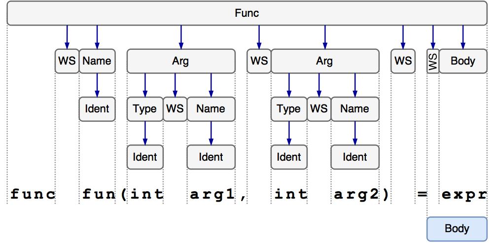

# Expressive Grammar Language (draft)
## Abstract
The Expressive Grammar Language (EGL) can be used to specify formal languages over an arbitrary alphabet.
*EGL* can describe all context free languages and also some non context free languages by using the *Without Expression* or 
by defining constraints. 
Besides, for each EGL grammar and for each string matching this grammar 
so called *Parse Trees* are defined that describe all possible logical structures of the string and give reason of why the string has matched.

## Definitions
An **Alphabet** is a set of distinguishable elements that are called **Characters**.
A **String** over an *Alphabet* `A` (or just an `A`-**String**) is a finite sequence in `A`.
**ASCII** refers to the *Alphabet* as defined by the ASCII charset.

### Text Fragments

A **Text Fragment** over an *Alphabet* `A` (or just an `A`-**Text Fragment**) 
consists of an `A`-**String** `Origin` and two natural numbers `Start` and `End` which can be zero. 
`Start` and `End` refer to the start and end positions within `Origin` hence `Start` must be lower or equal than `End`. 
The **Text** of a *Text Fragment* is the substring of `Origin` that starts at the given position and has the length of `End` minus `Start`.

The most important difference between *Strings* and *Text Fragments* is
that even though the *Text* of two *Text Fragments* can be equal, the *Text Fragments* itself do not have to.
Besides, two *Text Fragments* can only be concatenized if they share the same origin and the end number of the first *Text Fragment* matches with the start number of the second.

## Productions
**Whitespaces** is an *ASCII*-*String* that consists of zero or more whitespace characters (ASCII hex-codes 09, 0A, 0D, 20).
An **Identifier** is an *ASCII*-*String* that matches the regular expression `[a-zA-Z][a-zA-Z0-9]`. 
A **Symbol** is an *Identifier* that is defined by a *Production*.  

A **Production Rule** (or just **Production**) is an *ASCII*-*String* that starts with an *Identifier* that names the *Symbol* to be defined 
followed by *Whitespaces*, two colons (":"), the equals sign ("="), further *Whitespaces* and an *Expression* that ends the *Production* definition.

A **Grammar** over an *Alphabet* `A` consists of *Productions* and a *Symbol* called the **Start Symbol**.
An `A`-*String* is a member of the formal language described by a *Grammar* over an *Alphabet* `A`, 
iff it matches the *Expression* that defines the *Start Symbol*.

## Expressions
An **Expression** is an *ASCII*-*String* that describes *Strings* over a certain *Alphabet* `A`.
Each *Expression* type defines conditions when an `A`-*String* matches such an *Expression*.
As well as *Strings*, *Text Fragments* can match *Expressions* analogous. 

In the following let `S` be an `A`-*String*.

These constructs are atomic *Expressions*:

* `.`  
is matched by `S` iff `S` consists of exactly one *Character*.
* `Sym`, where `Sym` is a *Symbol* defined by a *Production*,  
is matched by `S` iff `S` matches the *Expression* that defines `Sym`.

Depending on the used *Alphabet* `A`, more atomic *Expressions* can be defined. 
See chapter *Unicode* for further atomic *Expressions* regarding *Unicode*.

If `Expr1` and `Expr2` are *Expressions*, the following *ASCII*-*Strings* are *Expressions* also:


* `(Expr1)`  and `Expr1` surrounded by *Whitespaces*  
are matched by a `S` iff `S` matches `Expr1`.

* Disjunction: `Expr1 | Expr2`  
is matched by `S` iff `S` matches `Expr1` or `Expr2`. This is not an exclusive disjunction, thus `S` can match both `Expr1` and `Expr2`.

* Conditional Disjunction: `Expr1 || Expr2`  
is matched by `S` iff `S` matches `Expr1 | (Expr2 \ Expr1)`. This construct is used to make the resulting *Parse Tree* unambigious, 
since strings matching both expressions will only lead to one *Parse Tree* with `Expr1` as symbol.
Note that `A || B || C` is equivalent to `A || (B || C)`, `A || (B | C\B)`, `A | (B | C\B)\A` and thus `A | B\A | C\B\A`.

* Concatenation: `Expr1 Expr2`  
is matched by `S` iff `S` is the concatenization of two `A`-*Strings* `S1` and `S2` so that `S1` matches `Expr1` and `S2` matches `Expr2`.

* Without: `Expr1 \ Expr2`  
is matched by `S` iff `S` matches `Expr1` but not `Expr2`. 
The *Without* operator is left-associative, i.e. `A \ B \ C` and `(A \ B) \ C` are equivalent.
  
* Optional: `Expr1?`  
is matched by `S` iff `S` has length zero or `S` matches `Expr1`.
  
* Star: `Expr*`  
is matched by `S` iff `S` has length zero or matches `Expr Expr*`.

* Positive Star: `Expr+`  
is matched by `S` iff `S` matches `Expr Expr*`.


The mentioned operators are right-associative if not said otherwise and 
are ordered ascending by their precedence. Thus `A \ B | C D?` and `(A \ B) | (C (D?))` are matching the same *Strings*.


## Parse Trees
Let `A` be an *Alphabet* and `S` an `A`-*String* that matches a certain *Symbol* `Sym` defined in a grammar over the *Alphabet* `A`.

**Parse Trees** of `S` relative to `Sym` are trees whose nodes are the *Text Fragments* of `S` together with the *Symbol* the *Text Fragment* has matched with.
The **root node** of these trees is `Sym` together with the *Text Fragment* of `S` whose *Text* equals `S`.

There is a *Parse Tree* for each possible *Symbol*/*Text Fragment* matching. 
All these possible *Parse Trees* are sorted by greediness in descending order, 
i.e. *Star Expressions* try to match the repeating expression as much as possible, 
*Concatenation Expressions* try to consume as much characters as possible for the first expression 
and *Disjunction Expressions* try to match the first expression first.

Children of a node are constructed by matching the node's text fragment `T` with the *Expression* `Expr` that defines the node's *Symbol*. 
For each *Symbol* `SubSym` within `Expr` that is matched with a sub text fragment `Ts` of `T`, a new node containing `Ts` and `SubSym` is added as child. 
These child nodes are ordered by the occurrence of `SubSym` in `Expr`.

*Parse Trees* are very similar to syntax trees yielded by context free grammars. 
However, *Parse Trees* do not contain terminal nodes and nodes can have arbitrary many children since symbols within *Star Expressions* can be matched multiple times.

## Unicode
**Unicode** refers to the *Alphabet* as defined by the *Unicode* charset. Accordingly, all unicode *Characters* can be represented by their code point.

A **Unicode Printable Character** is a *Unicode Character* whose hexadecimal code point is in the following list:

* `09` (horizontal tab)
* `0A` (line feed)
* `0D` (carriage return)
* `20`, `21`, ..., `7E` 
* `85` (next line)
* `A0`, `A1`, ..., `D7FF`
* `E000`, `E001`, ..., `10FFFF`

Thus a *Unicode Printable Character* can be any unicode character excluding the surrogate block and the C0 and C1 control codes with the exception of a few whitespace characters.

Besides, for *Unicode Grammers*, the following *ASCII Strings* are valid *Expressions*:

* `#xN` where `N` is a hexadecimal integer.  
Is matched by the *Unicode-String* that represents a single character whose code point is `N`. Leading zeros in `N` are insignificant.
  
* `[a-zA-Z]`, `[#xN-#xN]`  
Is matched by any *Unicode-Strings* that represent a single character with a value in the range(s) indicated (inclusive).
Only *Unicode Characters* that fall into the ASCII range can be used within the *Expression String*. When referring to a *Unicode Character* that does not, the code point notation can be used.

* `[abc]`, `[#xN#xN#xN]`  
Is matched by any Char with a value among the characters enumerated. Enumerations and ranges can be mixed in one set of brackets.

* `"Str"` and `'Str'` where `Str` is an *ASCII-String*.  
Is matched by the *Unicode-String* that is equal to `Str`.

* `unicode:Str` where `Str` is a valid name of an Unicode property like `ID_Start` or `ID_Continue`.  
Is matched by any Char that has the given unicode property.

## Examples
### Grammar of Simple Function Definitions

A simple grammar over the unicode alphabet that describes simple function definitions could look like:
```
Func ::= "func" WS Name WS? "(" WS? (Arg (WS? "," WS? Arg)*)? ")" WS? "=" WS? Body
WS ::= " "+
Name ::= Ident
Ident ::= [a-zA-Z][a-zA-Z0-9]*
Arg ::= Type WS Name
Type ::= Ident
Body ::= .*
```
The start symbol of the grammar is `Func`.

The string `func  fun(int  arg1,  int  arg2)  =  expr` that matches the grammar yields the following two *Parse Trees*:



The second *Parse Tree* differs from the first in the `Body` element that encloses the text of the last `WS` node now.

### Grammar of EGL Productions
Without the unicode extensions, a valid *EGL* production is an *ASCII* string that matches 
the unicode grammar with the start symbol `Production` and the following rules:
```
Production ::= Identifier WS* "::=" WS* Expr WS*

Identifier ::= [a-zA-Z][a-zA-Z0-9]*
WS ::= #x09 | #x0A | #x0D | #x20

Expr ::= Dot || Symbol || "(" Expr ")" || Disj || CondDisj || Concat || Without || Opt || Star || PosStar

Dot ::= "."
Symbol ::= Identifier

CondDisj ::= (Expr \ CondDisj) WS* "||" WS* Expr
Disj ::= (Expr \ Disj) WS* "|" WS* Expr

Concat ::= (Expr \ Concat) WS* Expr

Without ::= Expr WS* "\" WS* (Expr \ Without)

Opt ::= Expr WS* "?"
Star ::= Expr WS* "*"
PosStar ::= Expr WS* "+"
```

This grammar is unambiguous, i.e. for each matching string there is exactly one *Parse Tree*. This is achieved by the *Conditional Disjunction* construct.
Note that even though the grammar describes strings over the unicode alphabet, 
all unicode strings that match this grammar are already ASCII strings.

The following productions describe additional expressions for unicode grammars:
```
AdditionalExpr ::= UnicodeProperty CodePointRef RangeList String1 String2

UnicodeProperty ::= "unicode:" [a-zA-Z_][a-zA-Z0-9_]*

CodePointRef ::= "#x" [0-9]+
Ascii ::= [#x00-#x80]

RangeChar ::= Ascii \ "-" \ "]" \ "["
RangeElement ::= CodePointRange | CharRange | RangeChar | CodePoint
CodePointRange ::= CodePointRef WS* "-" WS* CodePointRef
CharRange ::= RangeChar WS* "-" WS* RangeChar
RangeList ::= "[" (WS* RangeElement)* "]"

StringChar ::= Ascii \ ['"]
String1 ::= "'" StringChar+ "'"
String2 ::= '"' StringChar+ '"'

```
